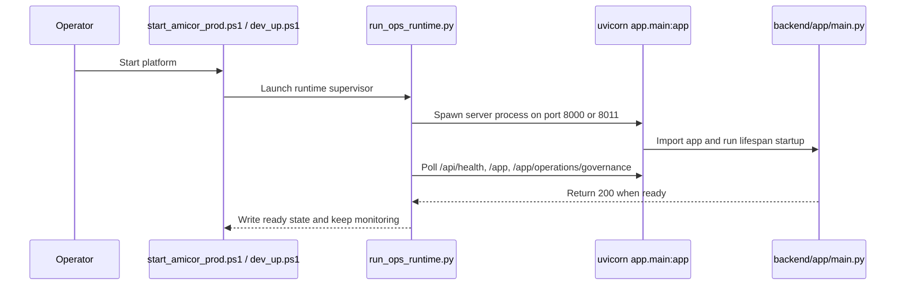
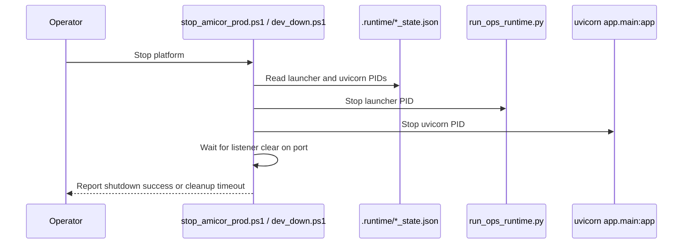

# Reliability Report

## Scope
This investigation focused only on service availability for the runtime listening on `8000` and `8011`.

I validated the live 8011 startup and shutdown path, inspected the launcher and shutdown scripts, and reviewed the runtime diagnostics history for evidence of outages or cleanup failures. The workspace cannot execute a real 30 minute, 1 hour, or 2 hour unattended host-idle soak, so those long-duration checks remain unproven here.

## Listener Ownership

### Port `8000`
Expected owner chain:
`scripts/start_amicor_prod.ps1` -> `scripts/amicor_runtime_watchdog.ps1` -> `scripts/run_ops_runtime.py` -> `uvicorn app.main:app` bound to `8000`.

The wrapper scripts are not the TCP listener. The listener is the `uvicorn` subprocess started by `run_ops_runtime.py`.

### Port `8011`
Expected owner chain:
`scripts/dev_up.ps1` -> `scripts/run_ops_runtime.py` -> `uvicorn app.main:app` bound to `8011`.

In the live validation run, the state file showed `launcher_pid=33052` and `uvicorn_pid=23544`, and `netstat` confirmed the listener on `127.0.0.1:8011` belonged to that runtime.

## Sequence Diagrams

### Startup

### Shutdown

## Failure Classification

Most likely root cause: **stale listener cleanup / PID ownership mismatch on the shutdown-restart path**.

Why this is the best-supported classification:
1. The runtime launcher does **not** shut the service down when health probes fail. It only logs degraded readiness and keeps running.
2. The current code path only takes the port down when the `uvicorn` process exits, a shutdown signal is sent, or a stop script explicitly kills the launcher/listener.
3. The diagnostics history already contains a real 8011 cleanup failure: `shutdown.listener_cleanup_timeout` and `restart.shutdown_failed`.
4. A live validation run in this session started and stopped 8011 successfully, which rules out a persistent bind/configuration problem.

## Ruled Out Or Low Probability

- Process crash: possible, but there is no evidence that the current outage is caused by a fatal app crash. The launcher logs crash events explicitly, and the observed history is stronger for cleanup failure.
- Watchdog termination: possible if an explicit stop/restart path fired, but the stronger evidence is the lingering listener cleanup failure.
- Startup race condition: low probability. The live startup completed and reached ready state.
- Port binding failure: low probability. 8011 bound successfully in the live run.
- Database connectivity failure: low probability as the primary cause of port disappearance. Health failures are logged, but they do not stop the launcher.
- Health check timeout: low probability. Readiness eventually completed, and probe failures do not terminate the runtime.
- Stale PID detection issue: **high probability**, and the best fit for the historical `shutdown.listener_cleanup_timeout` / `restart.shutdown_failed` evidence.

## Evidence

- Live 8011 startup completed successfully during this investigation, and the runtime was later stopped cleanly.
- The current runtime state showed a valid launcher PID and `uvicorn` PID for 8011 before shutdown.
- Historical diagnostics in `.runtime/runtime_diagnostics.jsonl` include:
  - `shutdown.listener_cleanup_timeout` on `8011`
  - `restart.shutdown_failed` on `8011`
- The launcher code only emits health probe failures; it does not terminate the runtime when a probe degrades.
- The new logging now records:
  - process start
  - process crash
  - health probe failures
  - stop events for the production wrapper

## Recommended Fix

1. Treat the 8011 outage as a listener-ownership cleanup problem first, not as a database or readiness-probe problem.
2. Preserve the new diagnostics so the next failure shows whether the port disappeared because the `uvicorn` process exited, because a stop script killed it, or because the listener never cleared.
3. If the outage reproduces again, inspect the latest `runtime_diagnostics.jsonl` entry for one of these signatures:
   - `runtime.process.crash`
   - `runtime.shutdown.signal`
   - `shutdown.listener_cleanup_timeout`
   - `restart.shutdown_failed`
4. If `shutdown.listener_cleanup_timeout` reappears, fix the stop path so it does not rely on a stale PID or a false-negative process owner check.

## Validation Performed

- PowerShell syntax validation passed for the edited scripts.
- Python syntax validation passed for the edited files.
- A live `8011` startup completed successfully.
- A clean `8011` shutdown completed successfully.

## Result

The strongest evidence points to a **stale listener cleanup / PID ownership issue** on the stop-restart path, not to a health probe, port bind, or database failure.