# Amicor Health ISF — Operational Workflow Maps

**Scope:** MVP operational workflows only. No claims processing, no AI-based dispatch optimization, no multi-region infrastructure.  
**Mission:** Coordinate reliable healthcare transportation for underserved and rural populations, starting with behavioral health appointments.

---

## Actors

| Actor | Role | Access |
|---|---|---|
| **Provider** | Healthcare clinic/org staff submitting ride requests | Partner portal |
| **Client / Rider** | Patient being transported to appointment | Indirect (via provider) |
| **Driver** | Vetted independent contractor executing rides | Driver mobile/web app |
| **Admin** | Amicor operations team | Admin dashboard |
| **System** | Amicor Health ISF platform | Automated events, notifications |

---

## Ride State Machine

All seven workflows below operate around a single canonical ride state.

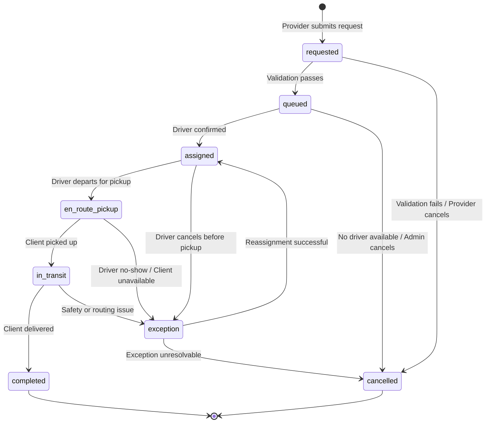

---

## Workflow 1 — Client Intake

**Purpose:** Capture and validate client (rider) information before a ride can be requested on their behalf.  
**Trigger:** Provider identifies a patient who needs transportation coordination.  
**MVP rule:** Providers manage client records. Clients do not log in.

### Steps

| Step | Actor | Action | System State |
|---|---|---|---|
| 1 | Provider | Logs into partner portal | — |
| 2 | Provider | Opens "New Client" form | — |
| 3 | Provider | Enters: full name, date of birth, phone, pickup address, accessibility needs | — |
| 4 | System | Validates service area coverage for pickup address | — |
| 5 | System | Checks for duplicate client record (name + DOB) | — |
| 6 | System | Creates client record; returns `client_id` | Client record: `active` |
| 7 | Provider | Associates client with their organization | — |
| 8 | Provider | Client is now selectable when submitting ride requests | — |

### Decision: Service Area Check

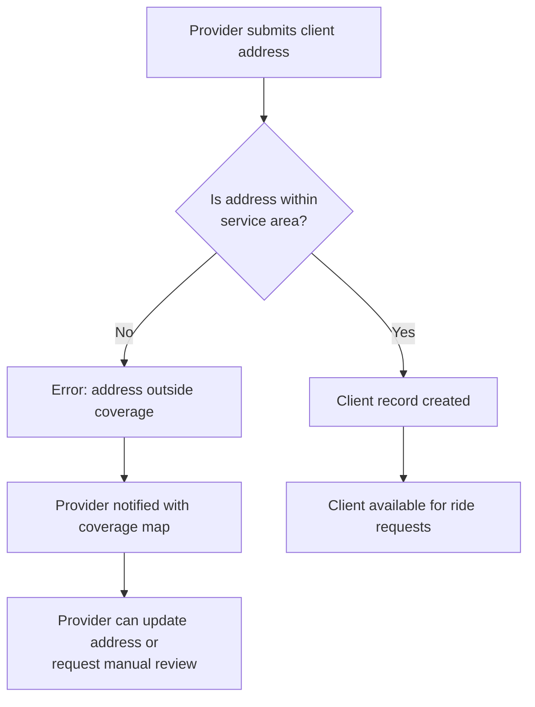

### Sequence Diagram

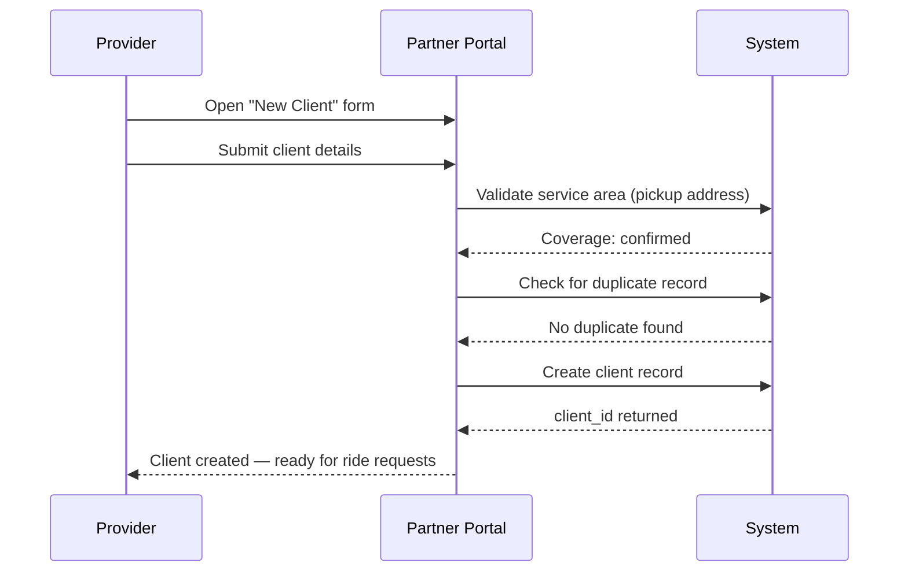

### MVP Scope Boundary

| In scope | Out of scope |
|---|---|
| Basic client record (name, DOB, phone, address, accessibility notes) | Client self-registration portal |
| Service area validation | Real-time geocoding / map display |
| Duplicate detection by name + DOB | Full EHR integration |

---

## Workflow 2 — Ride Request

**Purpose:** Provider submits a transportation request for a specific client and appointment.  
**Trigger:** Provider needs to book a ride for a client.  
**Dependency:** Client record must exist (Workflow 1).

### Steps

| Step | Actor | Action | System State |
|---|---|---|---|
| 1 | Provider | Opens "New Ride Request" in portal | — |
| 2 | Provider | Selects client from their roster | — |
| 3 | Provider | Enters: pickup address, destination, appointment datetime, return trip needed | — |
| 4 | Provider | Adds notes (e.g., "uses wheelchair", "needs 15-min pickup window before 2pm appt") | — |
| 5 | System | Validates: timing window, service area, required lead time (min. 24 hrs) | — |
| 6 | System | Creates ride record; assigns `requested` status | `requested` |
| 7 | System | Sends confirmation to provider (request ID, details summary) | — |
| 8 | System | Moves ride to dispatch queue | `queued` |

### Decision: Ride Request Validation

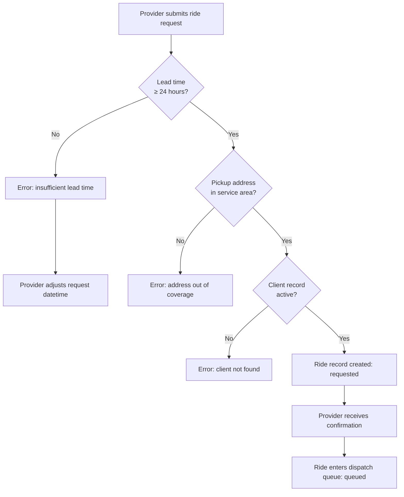

### Sequence Diagram

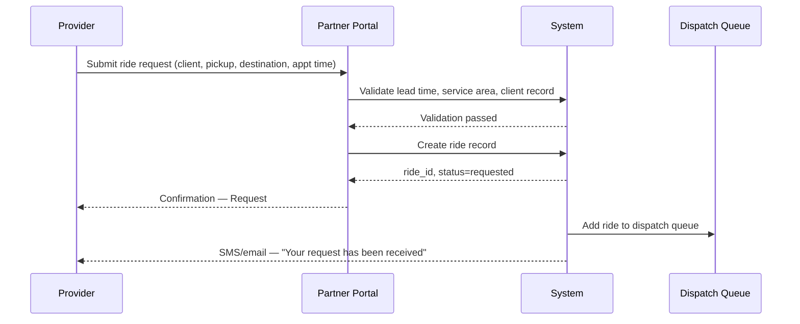

### Required Fields (MVP)

| Field | Required | Notes |
|---|---|---|
| Client | Yes | Must be in provider's roster |
| Pickup address | Yes | Must be in service area |
| Destination | Yes | Clinic name + address |
| Appointment datetime | Yes | Used to calculate pickup window |
| Return trip | No | Boolean; spawns second ride record |
| Accessibility notes | No | Free text — communicated to driver |
| Provider contact | Auto | Pulled from logged-in provider record |

### MVP Scope Boundary

| In scope | Out of scope |
|---|---|
| 24-hr minimum lead time | Same-day/urgent ride requests |
| Manual return trip as a separate request | Automatic return trip scheduling |
| Provider notes to driver | Rider self-service booking |

---

## Workflow 3 — Driver Assignment

**Purpose:** Match a queued ride to an available, eligible driver.  
**Trigger:** Ride enters `queued` state.  
**MVP model:** Admin-assisted manual assignment with system-provided availability view. No automated AI dispatch in MVP.

### Steps

| Step | Actor | Action | System State |
|---|---|---|---|
| 1 | Admin | Views assignment queue in dashboard | — |
| 2 | Admin | Selects a queued ride | — |
| 3 | System | Displays available drivers: proximity, vehicle type, current schedule | — |
| 4 | Admin | Selects driver; confirms assignment | — |
| 5 | System | Sends assignment offer to driver (push notification / SMS) | — |
| 6 | Driver | Reviews trip details: pickup address, client notes, appointment time | — |
| 7 | Driver | Accepts assignment | `assigned` |
| 8 | System | Notifies provider of assignment (driver name, ETA window) | — |
| 9 | Driver | Declines assignment | — |
| 10 | Admin | Selects next available driver and repeats | — |
| 11 | System | Escalation alert if no driver accepts within 2 hours | `exception` → admin |

### Assignment Decision Flow

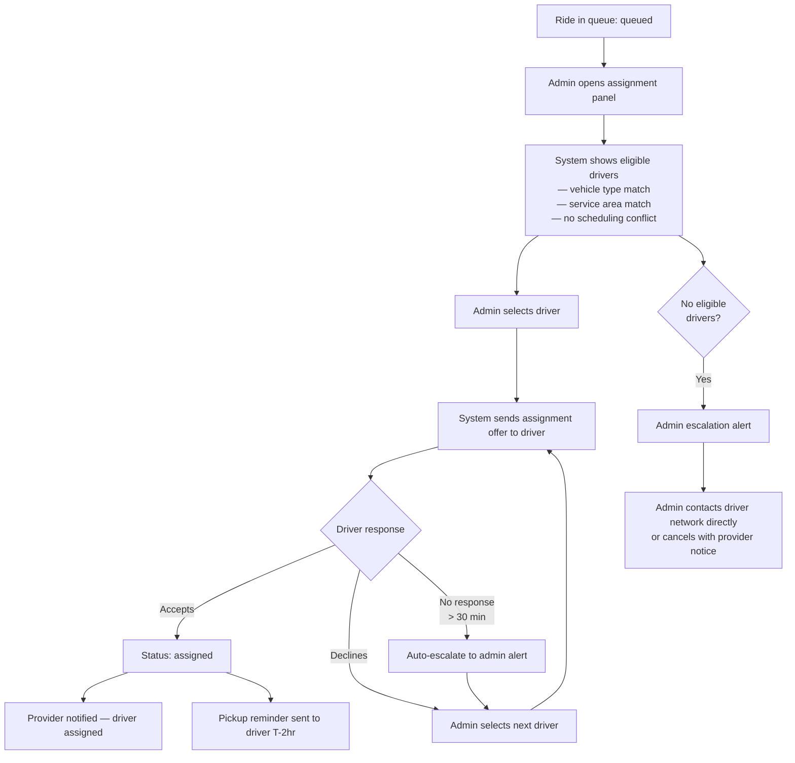

### Sequence Diagram

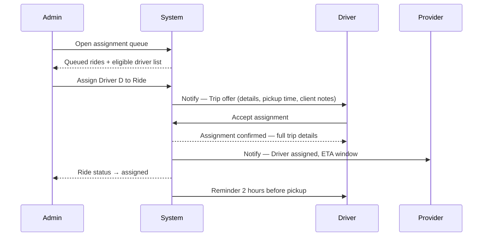

### Driver Eligibility Criteria (MVP)

| Criterion | Required |
|---|---|
| Active / not suspended | Yes |
| Vehicle type matches client needs (standard / wheelchair-accessible) | Yes |
| No overlapping assignment in the pickup window | Yes |
| Service area covers pickup location | Yes |
| Active insurance on file | Yes |

### MVP Scope Boundary

| In scope | Out of scope |
|---|---|
| Admin-driven manual assignment with driver list | Automated AI-based driver matching |
| Driver accept/decline with 30-min timeout | Driver bidding / auction model |
| Vehicle type matching | Real-time GPS proximity ranking |

---

## Workflow 4 — Dispatch

**Purpose:** Driver executes the ride from departure through client delivery.  
**Trigger:** Ride reaches `assigned` state and pickup time approaches.  
**Dependency:** Workflow 3 (Driver Assignment) complete.

### Steps

| Step | Actor | Action | System State |
|---|---|---|---|
| 1 | System | Sends driver reminder 2 hours before pickup | — |
| 2 | Driver | Departs toward client pickup address | `en_route_pickup` |
| 3 | Driver | Marks "En route" in driver app | — |
| 4 | System | Notifies provider: "Driver is en route" | — |
| 5 | Driver | Arrives at pickup location | — |
| 6 | Driver | Confirms client pickup in app (client name verification) | `in_transit` |
| 7 | System | Notifies provider: "Client en route to appointment" | — |
| 8 | Driver | Arrives at destination | — |
| 9 | Driver | Confirms delivery in app | `completed` |
| 10 | System | Notifies provider: "Ride completed" | — |
| 11 | System | Triggers billing record creation and payout record | — |

### Dispatch State Flow

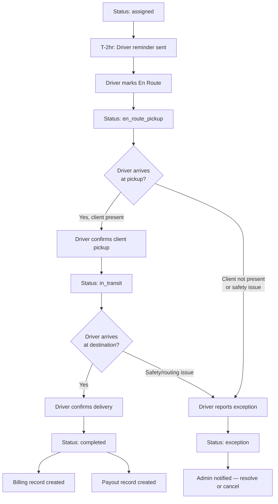

### Exception Handling During Dispatch

| Exception Type | Immediate Action | Resolution Path |
|---|---|---|
| Driver no-show | Auto-alert admin + provider | Admin reassigns or cancels |
| Client not at pickup after 15 min | Driver marks exception | Admin contacts provider; decide wait or cancel |
| Client refuses ride | Driver marks exception | Provider notified; ride cancelled |
| Safety incident | Driver marks emergency | Admin escalation + incident record |
| Vehicle breakdown | Driver marks exception | Admin reassigns; new driver dispatched |

### Sequence Diagram

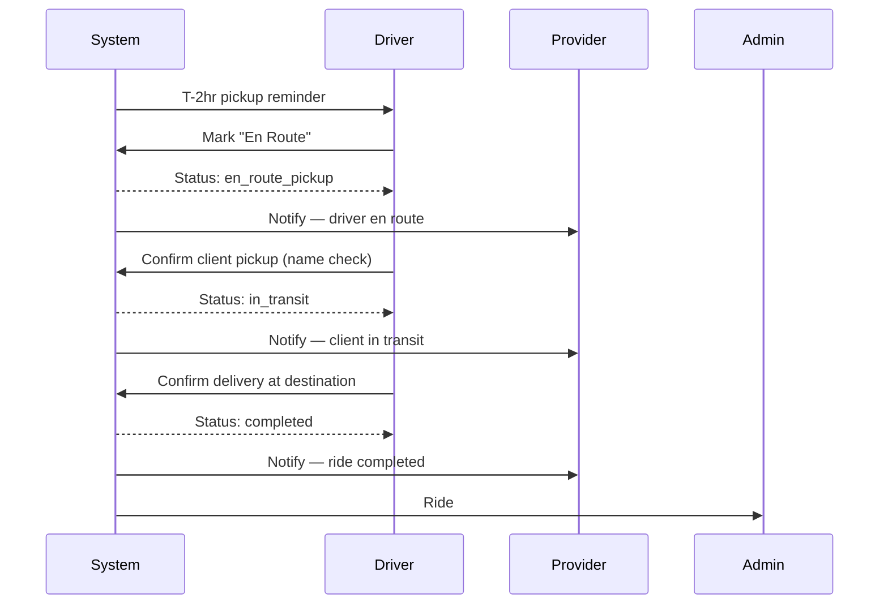

### MVP Scope Boundary

| In scope | Out of scope |
|---|---|
| Manual driver status updates via app | Real-time GPS tracking |
| Exception reporting with admin escalation | Automated incident response |
| Appointment window verification at dispatch | Live appointment system integration |

---

## Workflow 5 — Provider Communication

**Purpose:** Keep the healthcare provider informed throughout the ride lifecycle without requiring them to actively monitor.  
**Trigger:** Every state transition in the ride lifecycle.  
**MVP channels:** Email + SMS (templated). In-portal status view.

### Notification Map

| Ride State Transition | Notification to Provider | Channel |
|---|---|---|
| `requested` created | "Request received — Request #ID" | Email |
| `queued` (validation passed) | — (included in initial confirmation) | — |
| `assigned` | "Driver assigned — [Driver Name], ETA window [time]" | Email + SMS |
| `en_route_pickup` | "Driver is on the way to pick up [Client Name]" | SMS |
| `in_transit` | "Client [Client Name] is en route to appointment" | SMS |
| `completed` | "Ride completed — [Client Name] delivered at [time]" | Email + SMS |
| `exception` | "Action needed — Issue with ride #ID: [exception type]" | Email + SMS + portal alert |
| `cancelled` | "Ride cancelled — [reason]. Contact us to reschedule." | Email |

### Communication Sequence (Full Ride)

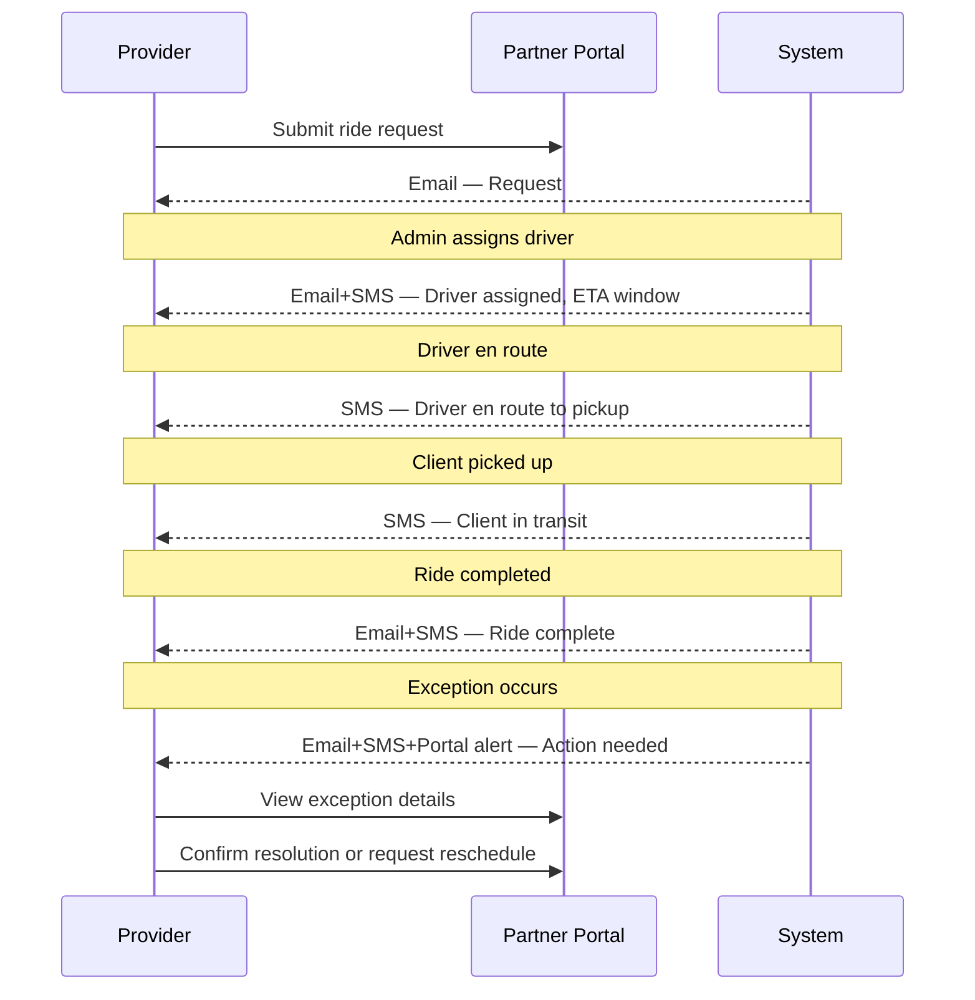

### Provider Portal View (MVP)

| View | What Provider Sees |
|---|---|
| **Dashboard** | Active rides (status, driver, client, ETA) |
| **Request history** | All past requests with status + timestamps |
| **New request** | Ride submission form |
| **Clients** | Client roster management |
| **Exceptions** | Active exceptions requiring provider acknowledgment |
| **Reports** | Monthly ride summary CSV export |

### MVP Scope Boundary

| In scope | Out of scope |
|---|---|
| Templated SMS + email notifications | Custom notification preferences per provider |
| Portal status view (read-only for ride progress) | Real-time map/GPS view |
| Exception alerts with acknowledge button | Two-way messaging between provider and driver |
| Monthly CSV report | BI dashboard / analytics portal |

---

## Workflow 6 — Billing

**Purpose:** Track revenue from providers and driver payouts accurately, with auditability.  
**Trigger:** Ride marked `completed`.  
**MVP model:** Invoice-based billing to providers (weekly batch). Direct payout to drivers (weekly, following completion).

### Billing Actors

| Actor | Role |
|---|---|
| Provider org | Pays Amicor for completed rides (per service agreement) |
| Amicor admin | Approves invoices, reviews exceptions |
| Driver | Receives payout per completed ride |

### Provider Billing Flow

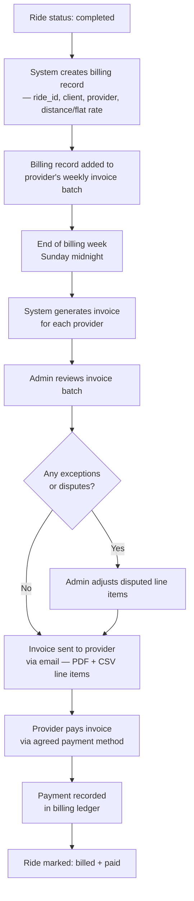

### Driver Payout Flow

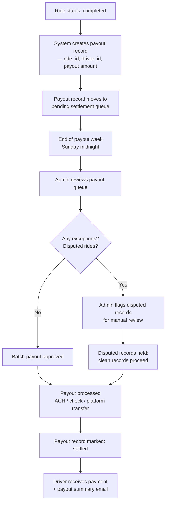

### Billing Sequence Diagram (End-to-End)

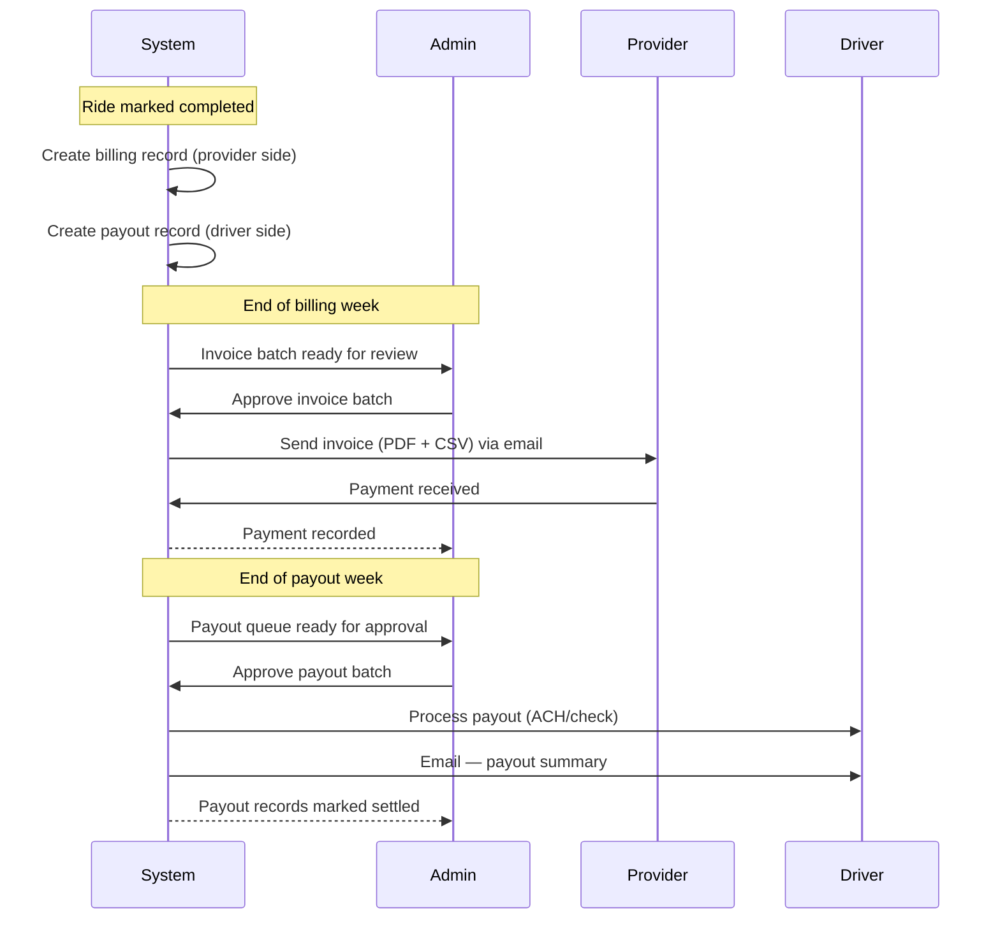

### Billing Data per Completed Ride

| Field | Source | Notes |
|---|---|---|
| `ride_id` | System | Immutable reference |
| `provider_id` | Ride record | Billing org |
| `driver_id` | Assignment record | Payout recipient |
| `client_id` | Ride record | For audit trail |
| `pickup_at` / `delivered_at` | Driver confirmation events | Timestamps |
| `rate_basis` | Service agreement | Flat rate or per-mile |
| `provider_invoice_amount` | Calculated | Revenue line |
| `driver_payout_amount` | Calculated | Contractor cost |
| `margin` | Calculated | Revenue - payout |
| `billing_status` | System | `pending` → `invoiced` → `paid` |
| `payout_status` | System | `pending` → `approved` → `settled` |

### Exception and Dispute Handling

| Scenario | Action |
|---|---|
| Driver cancelled after assignment | Ride not billed; no payout |
| Ride cancelled by provider | Not billed unless same-day cancellation policy applies |
| Client no-show | Admin discretion; partial fee may apply per service agreement |
| Driver dispute on payout amount | Admin holds disputed record; reviews and adjusts |
| Provider disputes a ride charge | Admin reviews completion evidence; adjusts or upholds |

### MVP Scope Boundary

| In scope | Out of scope |
|---|---|
| Weekly invoice batch to providers | Real-time billing / per-ride invoicing |
| Weekly driver payout batch | Instant payout / driver wallet |
| Admin approval step before each batch | Fully automated billing |
| PDF + CSV invoice | Stripe / payment gateway integration |
| Manual payment recording | Automated payment reconciliation |

---

## Workflow 7 — Admin Dashboard

**Purpose:** Give the Amicor operations team complete visibility and control over the Health ISF platform.  
**Trigger:** Continuous — admin accesses dashboard during operating hours.  
**Access:** Admin role only.

### Dashboard Sections

| Section | Purpose | Key Actions |
|---|---|---|
| **Live Queue** | Real-time view of all active rides by status | Assign, reassign, escalate, cancel |
| **Assignment Panel** | Queued rides + available drivers | Manual driver assignment |
| **Exception Queue** | All rides in `exception` state | Resolve, reassign, or cancel |
| **Driver Activity** | Active drivers, current assignments, availability | Mark unavailable, contact driver |
| **Payout Queue** | Pending driver payouts awaiting approval | Approve batch, flag dispute |
| **Invoice Queue** | Pending provider invoices awaiting review | Approve and send |
| **Provider Accounts** | All registered provider orgs and contacts | Add provider, manage contacts |
| **Driver Roster** | All vetted drivers and onboarding status | Activate, suspend, view records |
| **Reports** | Operational metrics and export | Generate ride summary, payout report |

### Admin Daily Operations Flow

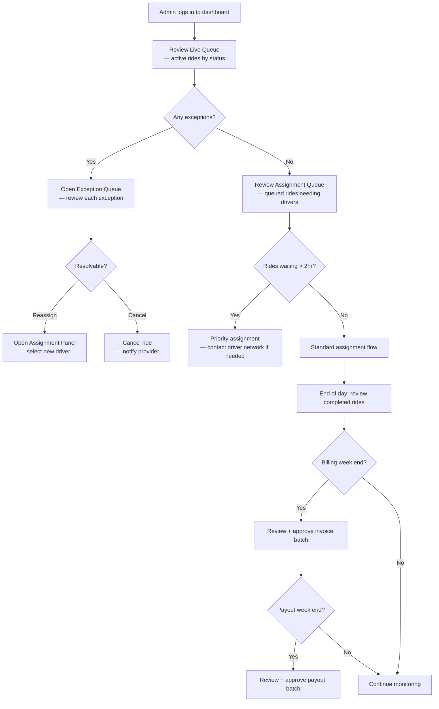

### Admin Exception Resolution Flow

```mermaid
sequenceDiagram
    participant Sys as System
    participant Admin as Admin
    participant D as Driver
    participant P as Provider

    Sys->>Admin: Alert — Ride #ID in exception state
    Admin->>Sys: Open exception details
    Sys-->>Admin: Exception type, timeline, driver notes

    alt Reassignment possible
        Admin->>Sys: Select new driver
        Sys->>D: New assignment offer
        D->>Sys: Accept
        Sys-->>Admin: Ride reassigned — status: assigned
        Sys->>P: Notify — new driver assigned
    else Cancellation required
        Admin->>Sys: Cancel ride
        Sys->>P: Notify — ride cancelled + reason
        Sys-->>Admin: Ride closed; exception logged
    end
```

### Reporting (MVP)

| Report | Frequency | Audience | Content |
|---|---|---|---|
| Ride summary | Weekly + on-demand | Admin, partners | Completed/cancelled/exception counts by provider |
| Driver activity | Weekly | Admin | Rides per driver, completion rate, exceptions |
| Payout summary | Weekly | Admin, drivers | Payout amounts per driver, status |
| Provider invoice | Weekly | Admin, providers | Billed rides, total invoice, payment status |
| Exception log | On-demand | Admin | All exceptions with resolution outcomes |
| Grant performance | Monthly | Admin | Ride counts, no-show reductions, coverage metrics |

### MVP Scope Boundary

| In scope | Out of scope |
|---|---|
| Manual assignment and reassignment | AI-powered dispatch optimization |
| Exception queue with resolve/cancel actions | Automated exception resolution |
| Weekly billing and payout approval | Real-time payment processing |
| CSV/PDF report export | BI dashboard, live charts |
| Driver and provider account management | Self-service partner onboarding portal |

---

## Operational Dependencies Map

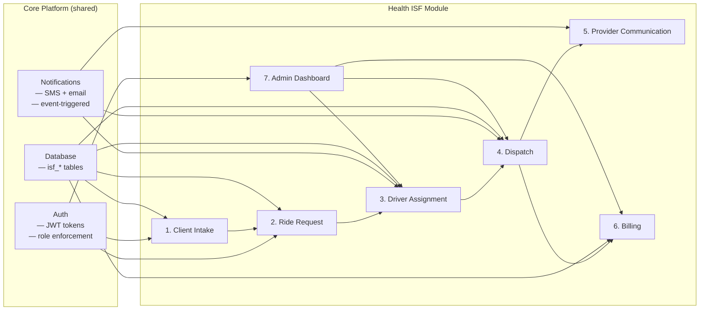

### Critical Path to First Completed Ride

```
Client record created (W1)
→ Ride request submitted (W2)
→ Ride validated + queued (W2)
→ Admin assigns driver (W3)
→ Driver accepts (W3)
→ Driver dispatches + completes (W4)
→ Provider notified (W5)
→ Billing record created (W6)
→ Admin reviews payout (W7)
```

---

## MVP Build Sequence

| Phase | Workflows | Deliverable |
|---|---|---|
| **Phase 1** | Auth + Client Intake (W1) | Provider login, client record creation |
| **Phase 2** | Ride Request (W2) | Submission form, validation, confirmation |
| **Phase 3** | Driver Assignment (W3) | Admin assignment queue, driver notification |
| **Phase 4** | Dispatch (W4) | Driver status updates, completion confirmation |
| **Phase 5** | Provider Communication (W5) | Notification templates, portal status view |
| **Phase 6** | Billing (W6) | Billing records, invoice batch, payout queue |
| **Phase 7** | Admin Dashboard (W7) | Full ops control center, reporting exports |

Each phase produces a testable, operational slice. The system is usable for real rides after Phase 4.
