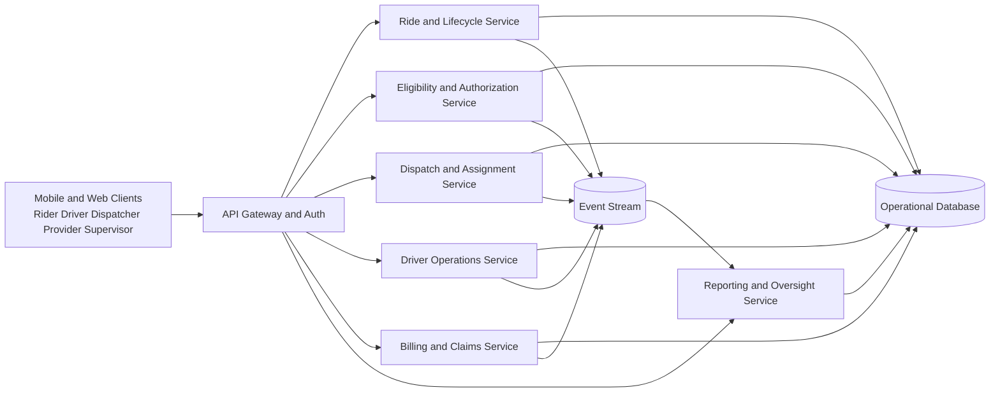

# AMICOR Health ISF Operational Blueprint

Status: Approved
Version: 1.0 (Approved Baseline)
Owner: Product + Operations + Engineering
Scope: Revenue-generating healthcare transportation operating system

## 1) System Architecture

### 1.1 Purpose
AMICOR Health ISF is a transportation operations platform that executes the end-to-end trip-to-cash lifecycle for healthcare transportation.

### 1.2 Architecture Principles
- Every screen and API must map to at least one lifecycle step.
- No orphan UI components outside operational workflows.
- Role-based permissions and supervised actions on critical transitions.
- Full auditability for dispatch, rider safety, and billing events.
- Event-driven state progression with deterministic lifecycle transitions.

### 1.3 Logical Architecture

### 1.4 Core Domain Objects
- RideRequest
- RideAuthorization
- DispatchQueueItem
- DriverAssignment
- TripExecution
- TripCompletion
- BillingClaim
- OversightCase

### 1.5 API and Data Contract Guardrails
- Lifecycle status transitions are validated server-side.
- Authorization checks are mandatory before dispatch.
- Billing claim creation requires a completed trip artifact.
- Reporting reads from immutable operational event history.

## 2) User Roles

- Rider or Patient: submits and tracks transportation requests.
- Driver: executes assigned transportation trips in the field.
- Dispatcher: manages queue, matching, assignment, and exceptions.
- Provider Coordinator: validates provider-side coverage and completion quality.
- Supervisor: approves overrides, resolves incidents, and enforces compliance.
- Billing Specialist: submits claims, reconciles payouts, and closes trip-to-cash.
- Admin: configuration and role policy management.

## 3) Transportation Lifecycle (Canonical)

1. Ride Request
2. Eligibility / Authorization
3. Dispatch
4. Driver Assignment
5. Driver Arrival
6. Passenger Pickup
7. Trip Execution
8. Trip Completion
9. Billing
10. Reporting
11. Provider Oversight

### 3.1 Lifecycle Service Matrix

| Step | Primary Service | Primary Actor | Required Artifact |
|---|---|---|---|
| Ride Request | Ride Service | Rider | request_id |
| Eligibility / Authorization | Authorization Service | Provider or Eligibility Engine | authorization_id |
| Dispatch | Dispatch Service | Dispatcher | queue_item_id |
| Driver Assignment | Dispatch Service | Dispatcher | assignment_id |
| Driver Arrival | Driver Operations | Driver | arrival_event |
| Passenger Pickup | Driver Operations | Driver | pickup_event |
| Trip Execution | Driver Operations | Driver | progress_events |
| Trip Completion | Driver Operations | Driver | completion_event |
| Billing | Billing Service | Billing Specialist | claim_id |
| Reporting | Reporting Service | Operations | report_id |
| Provider Oversight | Oversight Service | Provider Coordinator or Supervisor | oversight_case_id |

## 4) Driver Workflow

Entry Condition: assigned ride exists and driver shift is active.

1. View Current Trip
2. Contact Rider
3. Mark Arrived
4. Mark No Show (if applicable)
5. Mark Pickup
6. Execute Trip
7. Complete Trip

Driver UI Contract:
- Primary screen fields: Rider Name, Pickup Address, Destination Address, ETA.
- Primary actions: Call Rider, Arrived, No Show, Pickup, Complete Trip.
- Secondary tabs only: Earnings, Documents, History.

## 5) Rider Workflow

1. Submit ride request with pickup and destination.
2. Confirm eligibility/authorization status.
3. Receive dispatch and assignment updates.
4. Track driver ETA and arrival.
5. Confirm pickup and ride in progress.
6. Confirm trip completion and support follow-up.

## 6) Dispatcher Workflow

1. Intake queued ride requests.
2. Validate authorization state.
3. Prioritize by urgency and SLA.
4. Assign driver.
5. Monitor arrival, pickup, and in-transit events.
6. Handle reassignment, no-show, and incident exceptions.

## 7) Provider Workflow

1. Submit and manage authorization approvals.
2. Monitor appointment-linked transportation readiness.
3. Validate completion quality and trip evidence.
4. Resolve provider-side disputes or service quality issues.

## 8) Supervisor Workflow

1. Review exceptions and policy breaches.
2. Approve overrides and escalations.
3. Validate governance and compliance adherence.
4. Review operational performance and risk hotspots.

## 9) Billing Workflow

1. Ingest completed trips with required completion artifacts.
2. Create and submit claims.
3. Reconcile denials and adjustments.
4. Track payout status and close trip-to-cash.
5. Publish billing and revenue reports.

## 10) Implementation Gate Policy

No new role screen or feature may proceed unless:
- It maps to one of the 11 lifecycle steps.
- Its role ownership is explicit.
- Transition and data artifacts are defined.
- Wireframe is approved.

## 11) Approval Checklist

| Blueprint Item | Status | Approver | Date |
|---|---|---|---|
| System Architecture | Approved | AMICOR Health ISF Executive Directive | 2026-06-10 |
| User Roles | Approved | AMICOR Health ISF Executive Directive | 2026-06-10 |
| Transportation Lifecycle | Approved | AMICOR Health ISF Executive Directive | 2026-06-10 |
| Driver Workflow | Approved | AMICOR Health ISF Executive Directive | 2026-06-10 |
| Rider Workflow | Approved | AMICOR Health ISF Executive Directive | 2026-06-10 |
| Dispatcher Workflow | Approved | AMICOR Health ISF Executive Directive | 2026-06-10 |
| Provider Workflow | Approved | AMICOR Health ISF Executive Directive | 2026-06-10 |
| Supervisor Workflow | Approved | AMICOR Health ISF Executive Directive | 2026-06-10 |
| Billing Workflow | Approved | AMICOR Health ISF Executive Directive | 2026-06-10 |

## 12) Execution Artifact

Approved execution backlog for implementation is documented in HEALTH_ISF_IMPLEMENTATION_BACKLOG.md.
